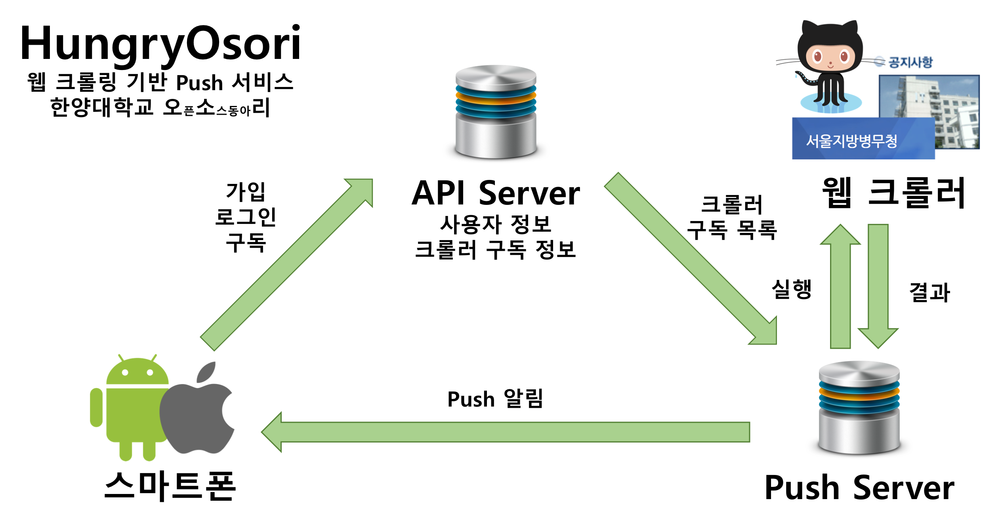

# Stay_Hungry
Stay_Hungry는 웹 크롤링 기반 Push 서비스입니다. 웹에서 컨텐츠가 변하면, 스마트폰 Push로 알려줍니다.<br>
D2 CAMPUS FEST 2016<br>

## Architecture


## Overview
*Push server<br>
Push server는 가지고 있는 Cralwer를 주기적으로 실행하며 변동사항이 있으면 사용자에게 알림 푸시를 합니다.<br>
*API server<br>
API서버는 전체적인 어플리케이션의 구동을 담당합니다.<br>
*IOS<br>
IOS는 Application을 통해 유저와 API Server간 통신을 합니다.<br>

## Source
* [Crawling & Push server](https://github.com/epikjjh/Stay_Hungry_Push-server) : 크롤러를 통해 웹의 변화를 확인하고, Push 메시지를 발송하는 서버
* [API server](https://github.com/epikjjh/Stay_Hungry_Server) : 회원관리, 크롤러 구독을 위한 서버
* [IOS Client](https://github.com/epikjjh/Stay_Hungry_IOS) : IOS Application

## 오픈소스 목록
* Scrapy 1.2(https://scrapy.org/) : Crawler
* Django 1.10( https://www.djangoproject.com/ ) : Server
* Django-RestFramework 3.4( http://www.django-rest-framework.org/ ) : Server
* PYFCM 1.2( https://pypi.python.org/pypi/pyfcm/ ) : Server
* Swift 3(https://developer.apple.com/swift/) : IOS
* Cocoapod 1.0.1(https://cocoapods.org/) : IOS
* Alamofire 4.0(https://github.com/Alamofire/Alamofire) : IOS

## Contributors
### iOS
* [seubseub](https://github.com/seubseub)

### Push Server
* [epikjjh](https://github.com/epikjjh)

### API Server
* [bees1114](https://github.com/bees1114)

## License
```
The MIT License (MIT)

Copyright (c) 2016 Hanyang Osori

Permission is hereby granted, free of charge, to any person obtaining a copy
of this software and associated documentation files (the "Software"), to deal
in the Software without restriction, including without limitation the rights
to use, copy, modify, merge, publish, distribute, sublicense, and/or sell
copies of the Software, and to permit persons to whom the Software is
furnished to do so, subject to the following conditions:

The above copyright notice and this permission notice shall be included in all
copies or substantial portions of the Software.

THE SOFTWARE IS PROVIDED "AS IS", WITHOUT WARRANTY OF ANY KIND, EXPRESS OR
IMPLIED, INCLUDING BUT NOT LIMITED TO THE WARRANTIES OF MERCHANTABILITY,
FITNESS FOR A PARTICULAR PURPOSE AND NONINFRINGEMENT. IN NO EVENT SHALL THE
AUTHORS OR COPYRIGHT HOLDERS BE LIABLE FOR ANY CLAIM, DAMAGES OR OTHER
LIABILITY, WHETHER IN AN ACTION OF CONTRACT, TORT OR OTHERWISE, ARISING FROM,
OUT OF OR IN CONNECTION WITH THE SOFTWARE OR THE USE OR OTHER DEALINGS IN THE
SOFTWARE.
```
